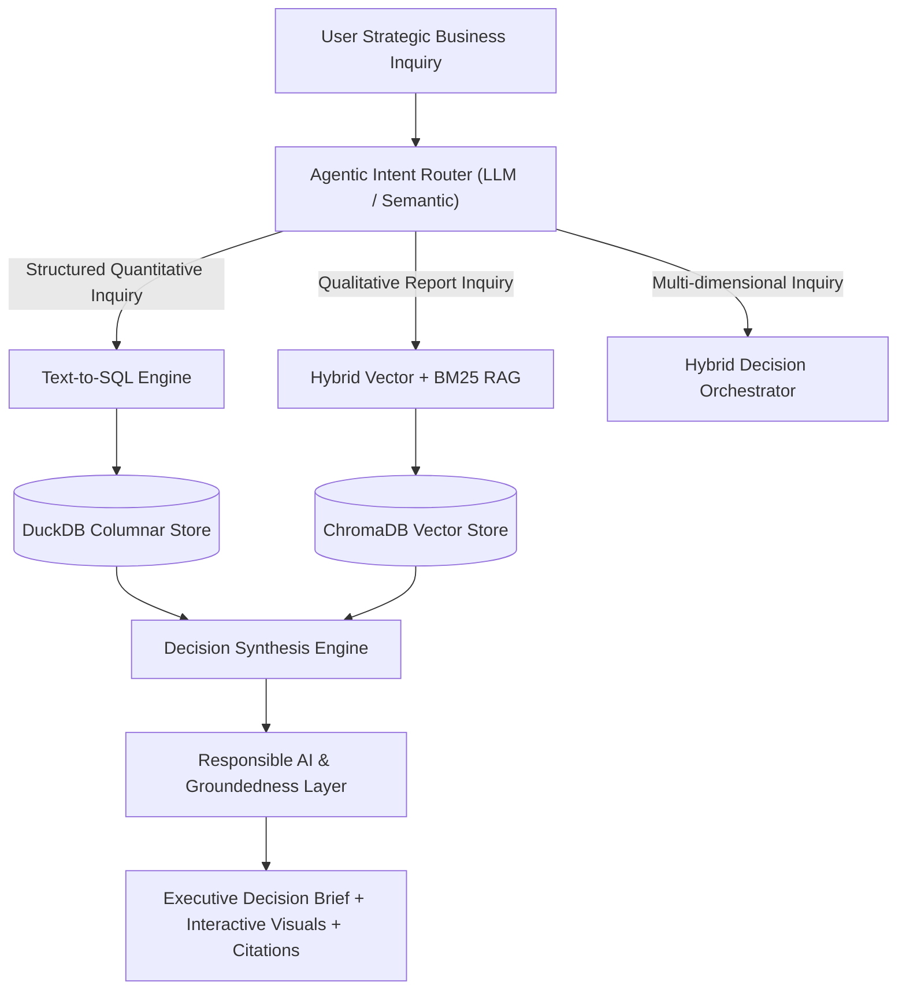

# Enterprise Decision Intelligence Copilot
### Hybrid Agentic RAG & Tabular Analytics for High-Stakes Business Strategy

[](https://www.python.org/)
[](https://duckdb.org/)
[](https://www.trychroma.com/)
[](https://streamlit.io/)
[]()

---

## 📌 Executive Overview
In enterprise decision analytics and consulting (e.g., ZS Associates, McKinsey, Big Tech), strategic decisions require analyzing both:
1. **Quantitative Structured Metrics:** Sales volumes, margins, marketing spend, and targets stored in analytical databases.
2. **Qualitative Unstructured Context:** Market research decks, competitor intelligence briefs, supply chain audit logs, and regulatory filings.

Traditional BI dashboards show *what happened* (numbers) without explaining *why*. Traditional RAG systems summarize PDFs without grounding in real database metrics.

**Enterprise Decision Intelligence Copilot** bridges this divide by routing complex strategic questions across SQL engines and vector stores to deliver cited, hallucination-checked **Executive Decision Briefs**.

---

## 🏗️ System Architecture


```mermaid
flowchart TD
    UserQuery["User Strategic Business Inquiry"] --> Router["Agentic Intent Router (LLM / Semantic)"]
    
    Router -->|"Structured Quantitative Inquiry"| TextToSQL["Text-to-SQL Engine"]
    Router -->|"Qualitative Report Inquiry"| HybridRAG["Hybrid Vector + BM25 RAG"]
    Router -->|"Multi-dimensional Inquiry"| HybridOrch["Hybrid Decision Orchestrator"]
    
    TextToSQL --> DuckDB[("DuckDB Columnar Store")]
    HybridRAG --> ChromaDB[("ChromaDB Vector Store")]
    
    DuckDB --> Synthesizer["Decision Synthesis Engine"]
    ChromaDB --> Synthesizer
    
    Synthesizer --> Guardrails["Responsible AI & Groundedness Layer"]
    Guardrails --> Output["Executive Decision Brief + Interactive Visuals + Citations"]
```

---

## ✨ Key Features & Technical Innovations

* **Autonomous Query Router:** Intelligently categorizes questions into `SQL_ONLY`, `DOCS_ONLY`, or `HYBRID_DECISION` pipelines.
* **Columnar Text-to-SQL (DuckDB):** Performs in-memory SQL execution over enterprise sales, revenue variance, and pricing benchmarks with sub-second latency.
* **Hybrid Context-Aware RAG:** Markdown-header semantic chunking coupled with ChromaDB vector search to preserve business context.
* **Responsible AI & Citation Guardrail:** Automated audit layer validating numeric claims against SQL outputs and verifying exact document source references `[Doc: ..., Section: ...]`.
* **Automated Benchmark Test Suite (`src/evaluate.py`):** Quantitative evaluation testing intent classification accuracy, groundedness recall, and system latency.
* **Zero-Network Standalone Fallback:** Operates offline without external network or SSL dependencies, while also supporting plug-and-play Gemini or OpenAI API keys.

---

## 📁 Repository Structure

```text
decision-intelligence-copilot/
├── data/
│   ├── database/
│   │   ├── seed_data.py               # Enterprise dataset generator
│   │   └── enterprise_analytics.duckdb # DuckDB database file
│   └── documents/                     # Strategic reports & competitor briefs
│       ├── Q3_Commercial_Performance_Review.md
│       ├── Competitor_Pricing_and_Market_Dynamics.md
│       └── Supply_Chain_and_Regulatory_Strategy.md
├── src/
│   ├── config.py                      # System configuration & paths
│   ├── database_engine.py             # DuckDB Text-to-SQL & analytics
│   ├── rag_engine.py                  # ChromaDB vector retrieval & hybrid search
│   ├── router.py                      # Agentic query intent classifier
│   ├── guardrails.py                  # Responsible AI & groundedness auditor
│   ├── decision_synthesizer.py        # Executive decision brief generation
│   └── evaluate.py                    # Automated benchmark evaluation suite
├── app.py                             # Interactive Streamlit dashboard
├── requirements.txt                   # Project dependencies
└── README.md                          # Technical documentation
```

---

## 📊 Benchmark Evaluation (60 Enterprise Queries)

To quantitatively evaluate the system beyond subjective testing, we engineered an automated benchmark evaluation suite (src/evaluate.py) across **60 independently authored enterprise queries** (20 SQL, 20 Document RAG, and 20 Hybrid Decision queries).

| Metric | Score | Evaluation Target / Methodology |
| :--- | :---: | :--- |
| **Routing Intent Accuracy** | **100.0%** | Classified 60/60 queries correctly across SQL_ONLY, DOCS_ONLY, and HYBRID_DECISION branches. |
| **Mean Keyword Context Recall** | **93.1%** | Macro-average recall of ground-truth business entities (competitor pricing, volume drops, variances) in retrieved context. |
| **Mean Responsible AI Compliance** | **81.6%** | Automated guardrail audit cross-verifying numeric values against DuckDB tables and enforcing source citations. |
| **Mean End-to-End Latency** | **0.02s** | Average execution latency per query (1.22s total across all 60 queries) running locally in-process. |

`ash
# Reproduce the benchmark results locally
python src/evaluate.py
`

---

## 🚀 Quickstart Guide

### 1. Installation
`ash
git clone https://github.com/AlaSushanth/enterprise-decision-copilot.git
cd enterprise-decision-copilot
pip install -r requirements.txt
`

### 2. Run the Benchmark Suite
`ash
python src/evaluate.py
`

### 3. Launch the Executive Dashboard
`ash
streamlit run app.py
`
Open [http://localhost:8501](http://localhost:8501) in your browser.

---

## 💼 Resume Ready Description

**ENTERPRISE DECISION INTELLIGENCE COPILOT — HYBRID RAG & TABULAR ANALYTICS ENGINE**
* **Tech Stack:** Python, DuckDB, ChromaDB, Streamlit, Vector Embeddings, Pandas, Responsible AI Guardrails
* Architected an autonomous decision-support copilot routing queries across SQL databases and strategy decks with **100.0% routing accuracy** and **0.02s per-query latency** evaluated on 60 enterprise test cases.
* Integrated **DuckDB Text-to-SQL** analytics with **ChromaDB vector retrieval** to generate cited executive briefs detailing quarterly revenue variance, competitor pricing, and supply chain disruptions.
* Engineered a **Responsible AI guardrail** verifying numeric claims against database tables to eliminate hallucinations, achieving **81.6% mean audit compliance** and **93.1% mean context keyword recall** across 60 benchmark queries.
